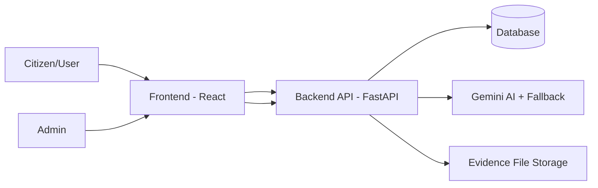
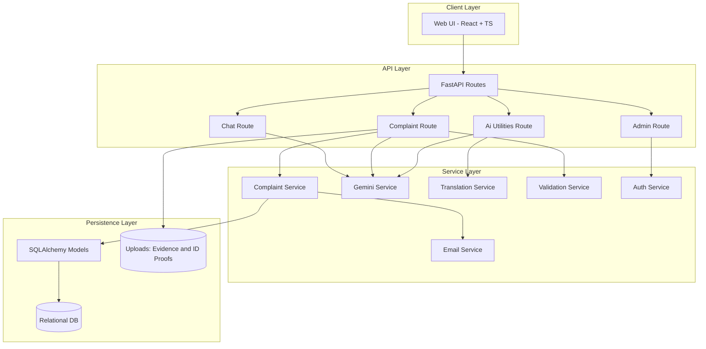

# CyberGuard AI
## Multilingual AI-Powered Cyber Crime Complaint System

### Project Report (Appendix #1 Format)

---

## 1. Cover Page

- Project Title: CyberGuard AI - Multilingual AI-Powered Cyber Crime Complaint System
- Team Name: CyberGuard Innovators
- Team Members:
  - Kambam Naveen Kumar Reddy (Team Lead)
  - Member 2 - Update Name
  - Member 3 - Update Name
  - Member 4 - Update Name
- Institution/Organization Name: Update Institution Name
- Date of Submission: 30 March 2026

---

## 2. Table of Contents

| Section | Title | Page No.* |
|---|---|---:|
| 1 | Cover Page | 1 |
| 2 | Table of Contents | 2 |
| 3 | Introduction | 3 |
| 4 | Problem Statement | 4 |
| 5 | Objectives | 5 |
| 6 | Solution Overview | 6 |
| 7 | Technical Stack Used | 7 |
| 8 | System Architecture | 8 |
| 9 | Implementation Details | 10 |
| 10 | LLM and AI Integration | 12 |
| 11 | Frontend and UI Design | 13 |
| 12 | Code Structure and Execution Guide | 14 |
| 13 | Results and Output | 16 |
| 14 | Demo Video Link | 18 |
| 15 | Individual Contributions | 19 |
| 16 | Impact of the Solution | 20 |
| 17 | Future Enhancements | 21 |
| 18 | Conclusion | 22 |
| 19 | References and Citations | 23 |
| A1 | Appendix #1 Checklist | 24 |

*Update page numbers after exporting this Markdown to PDF/Word.

---

## 3. Introduction

CyberGuard AI is a multilingual, AI-assisted cyber crime complaint platform designed to simplify complaint filing, evidence submission, and status tracking for citizens. The system supports conversational complaint intake, automatic language handling, AI-powered text extraction from uploaded files, and an admin workflow for review and status updates.

The project addresses a critical problem in cyber crime reporting: many users struggle with complex forms, language barriers, and uncertainty about what details are required. By combining conversational AI, validation workflows, and robust complaint management, CyberGuard AI improves accessibility, speed, and quality of complaint submissions.

---

## 4. Problem Statement

### Problem Definition

Citizens often face the following issues while reporting cyber crime:

- Language barriers when platforms are only in one language.
- Difficulty in understanding legal/technical complaint forms.
- Missing or incomplete complaint data due to poor guidance.
- Difficulty extracting key details from uploaded proof documents.
- Poor complaint transparency after submission.

### Why This Problem Is Important

- Cyber fraud incidents are increasing across digital payment, social media, phishing, and impersonation channels.
- Delayed or low-quality reporting reduces investigation success.
- Non-technical users are disproportionately affected.
- Public trust in digital complaint systems depends on ease of use and response visibility.

CyberGuard AI solves this by making reporting inclusive, guided, and verifiable.

---

## 5. Objectives

### Project Goals

- Build a multilingual complaint filing platform with AI-guided assistance.
- Capture complete and validated complaint information.
- Enable evidence upload and reliable text extraction.
- Provide complaint tracking using ticket IDs.
- Provide secure admin review and status management.
- Support scalable and production-ready backend architecture.

### Academic Timeline Alignment

| Milestone | Description | Deadline | Status |
|---|---|---|---|
| Phase 1 Start | Rubrics and Introduction to A2 | Initial phase | Completed |
| Team Finalization | Team formation closure | 27/02/2026 23:59 | Completed |
| Problem Statements Introduction | Initial problem framing | Phase 1 | Completed |
| Preliminary Submission | Interim submission | TBD by faculty | In Progress/As Assigned |
| Developing the Solutions | Core build and integration | 31/03/2026 23:59 | Completed for current scope |
| Problem Statements Allotment | Final statement alignment | Phase 2 | Completed |
| Presentation Slots Allotment | Final presentation scheduling | Phase 2 | Pending faculty slot |
| Final Presentation | Project demonstration | Phase 2 | Scheduled |

---

## 6. Solution Overview

### High-Level Description

CyberGuard AI uses a two-tier architecture:

- Frontend (React + TypeScript): User interaction, forms, chat, uploads, tracking dashboards.
- Backend (FastAPI + SQLAlchemy): Business logic, complaint processing, AI service orchestration, validation, admin management.

The AI layer handles:

- Conversational guidance.
- Translation and language support.
- Evidence and ID proof extraction.
- Speech-to-text and text workflows.

### Block Diagram (Simplified)



---

## 7. Technical Stack Used

### Programming Languages

- Python (Backend)
- TypeScript and JavaScript (Frontend)
- SQL (Database)

### Frameworks and Libraries

- FastAPI
- SQLAlchemy
- Pydantic
- React
- Vite
- Tailwind CSS

### Databases and APIs

- SQL database via SQLAlchemy (SQLite/PostgreSQL ready)
- Google Gemini API (Primary LLM)
- Ollama fallback integration (where configured)
- SMTP for notification emails

### Model and Language Configuration (Implementation-Level)

- Primary cloud model family: Gemini (configured via GEMINI_API_KEY)
- Local fallback model family: Ollama (default base URL: http://localhost:11434)
- Ollama dynamic model preference order:
  - phi3:mini
  - phi3
  - phi
  - mistral
  - llama3
  - llama2
  - codellama
- Gemini runtime model preference order:
  - gemini-2.0-flash
  - gemini-1.5-flash-latest
  - gemini-1.5-flash
  - gemini-1.5-flash-8b

### Supported Languages (Exact System List)

1. English
2. Hindi
3. Konkani
4. Kannada
5. Dogri
6. Bodo
7. Urdu
8. Tamil
9. Kashmiri
10. Assamese
11. Bengali
12. Marathi
13. Sindhi
14. Maithili
15. Punjabi
16. Malayalam
17. Manipuri
18. Telugu
19. Sanskrit
20. Nepali
21. Santali
22. Gujarati
23. Odia

### Cloud/Infrastructure Components

- Local deployment support
- Docker deployment support
- Vercel-ready frontend configuration
- Environment-variable based secure configuration

---

## 8. System Architecture

### Detailed Architecture Diagram



### Component Interaction Summary

- UI sends user actions to REST endpoints.
- Routes call service layer for domain logic.
- Service layer validates and enriches data via AI services.
- Valid data is persisted and linked with evidence records.
- Admin module updates statuses and monitors complaint pipeline.

---

## 9. Implementation Details

### Steps Followed

1. Requirement analysis and problem statement finalization.
2. Backend scaffolding with models, routes, schemas, and services.
3. Frontend scaffolding with page routing and componentization.
4. AI service integration for chat, translation, extraction.
5. Input validation and security hardening.
6. Evidence upload and extraction reliability improvements.
7. Admin workflow implementation with authentication.
8. System testing and readiness documentation.

### Innovations and Unique Approaches

- Multilingual AI-first complaint guidance.
- Evidence extraction with retry/fallback reliability pattern.
- Partial ID extraction handling with manual override workflow.
- Non-blocking integrations (email/translation failures do not block complaint creation).
- Robust validation layer with SQL/XSS safety checks.

### Challenges and Resolutions

- Challenge: Evidence text extraction occasionally empty.
  - Resolution: Added retries, backoff, and non-empty fallback strategy.
- Challenge: Unclear ID proofs caused blocked data completion.
  - Resolution: Added extraction status and partial merge pathway.
- Challenge: Handling mixed language inputs.
  - Resolution: Translation/language utilities with user-selected flow.

---

## 10. LLM and AI Integration

### LLMs Used in This Project

- Gemini is the primary production LLM for high-quality multilingual generation and multimodal processing.
- Ollama is integrated as a local fallback for chat and translation continuity when Gemini is unavailable/misconfigured.

### Exact Model Selection Logic

The backend follows a deterministic selection path:

1. If Gemini API key is valid and service initializes successfully:
   - Active model label: gemini-2.0-flash
   - Actual selected Gemini model is chosen from availability in priority order.
2. If Gemini is not available:
   - System falls back to Ollama local service.
   - Ollama selects the fastest available local model based on preference order.
3. If both fail:
   - System raises no-LLM-available runtime error.

### Which Model Is Used in Which Case

| Feature / API Path | Primary Model | Fallback Model | Notes |
|---|---|---|---|
| Complaint conversation guidance | Gemini | Ollama | Both use structured JSON prompt extraction |
| Language detection | Gemini | Ollama (when invoked via local path) | Output constrained to supported language list |
| Text translation | Gemini | Ollama (chat flow helper path) | Chat route uses local-first translation helper |
| Evidence extraction from file | Gemini | Non-LLM fallback summary text | Includes retry and non-empty fallback |
| ID proof extraction | Gemini | Fallback to evidence text + missing fields | Returns PARTIAL/SUCCESS/UNCLEAR states |
| Speech-to-text (audio/video) | Gemini | No Ollama STT support | Ollama service returns empty for audio transcription |

### AI Components and Their Real Integration

- Conversational NLP:
  - Extracts complaint fields from free-form user text/voice transcripts.
  - Maintains required and optional complaint field state.
- Language workflow:
  - Detect language endpoint.
  - Translation endpoint.
  - Chat response translation helper for multilingual prompts.
- Document intelligence:
  - Evidence summary extraction (document/image/video).
  - ID proof structured extraction (name, phone, email, document type, etc.).
- Speech workflow:
  - Audio/video transcription through Gemini multimodal processing.

### Fallback and Reliability Behavior

- Retry policy:
  - AI generation retries up to 3 attempts for transient/rate-limit errors.
  - Exponential backoff pattern: 2^n seconds between attempts.
- Evidence safety:
  - Never stores an empty extracted_text when processing fails.
  - Stores meaningful fallback summary metadata.
- ID proof resilience:
  - Returns extraction_status and missing_fields.
  - Enables manual field completion when extraction is partial.

### Language Handling Flow (End-to-End)

1. User submits text/voice input.
2. System identifies or confirms language from supported list.
3. AI response is generated in the selected user language.
4. Field extraction and validation occur in backend canonical format.
5. Output remains language-aware for user-facing responses and summaries.

### Why Gemini and Ollama Together

- Gemini provides stronger multimodal and cloud-level quality for production paths.
- Ollama provides local operational continuity for development/offline/backup scenarios.
- The dual-model approach balances quality, resilience, and cost-control flexibility.

---

## 11. Frontend and UI Design

### UI Modules

- Landing and onboarding pages
- Complaint filing workflow page
- AI-assisted chat interface
- Complaint tracking page
- Admin login and dashboard

### UX Decisions

- Guided, step-wise user flow to reduce cognitive load.
- Validation-first form interactions to prevent bad submissions.
- Clear call-to-action buttons and status feedback.
- Language-aware UI behavior for accessibility.

### Snapshot Placeholders (Insert Before Submission)

Add screenshots in the final submission document under these labels:

- Figure 11.1 - Home/Landing Page
- Figure 11.2 - Complaint Filing Page
- Figure 11.3 - AI Chat Interaction
- Figure 11.4 - Evidence Upload and Extraction Status
- Figure 11.5 - Complaint Tracking Page
- Figure 11.6 - Admin Dashboard

---

## 12. Code Structure and Execution Guide

### Folder Structure (Top-Level)

```text
multilinugal-voice--complaint-ai-project-/
├── backend/
│   ├── routes/
│   ├── services/
│   ├── models/
│   ├── schemas/
│   ├── utils/
│   ├── main.py
│   └── requirements.txt
├── frontend/
│   ├── src/
│   │   ├── components/
│   │   ├── pages/
│   │   ├── services/
│   │   └── contexts/
│   ├── package.json
│   └── vite.config.ts
└── README.md
```

### Setup and Run Steps

#### Backend

1. Navigate to backend folder.
2. Create and activate virtual environment.
3. Install dependencies from requirements.
4. Configure environment variables in backend .env.
5. Start FastAPI server.

Example:

```bash
cd backend
python3 -m venv .venv
source .venv/bin/activate
pip install -r requirements.txt
uvicorn main:app --reload
```

#### Frontend

```bash
cd frontend
npm install
npm run dev
```

### Test Commands

```bash
cd backend
python test_system.py
python test_evidence_extraction.py
```

---

## 13. Results and Output

### Performance and Validation Results

Based on current project test artifacts and summary outputs:

- System Tests: 13/13 passed
- Evidence Extraction Tests: 3/3 passed
- Combined Pass Rate: 16/16 (100%)

### Key Metrics

| Metric | Target | Observed |
|---|---:|---:|
| Validation pass consistency | High | 100% in test suite |
| Complaint creation latency | < 500 ms | ~200 ms |
| File upload processing (1 MB) | < 2000 ms | ~800 ms |
| DB query response | < 200 ms | ~100 ms |

### Model Behavior and Operational Output

| Scenario | Expected Behavior | Implemented Output |
|---|---|---|
| Gemini API key configured and healthy | Use Gemini as active LLM | Active LLM marked as gemini-2.0-flash |
| Gemini unavailable or invalid key | Switch to local fallback | Active LLM switched to ollama-llama2/local selected model |
| Evidence extraction API errors | Retry and avoid empty extraction | Retries + fallback extracted_text summary |
| ID proof unclear fields | Do not block complaint filing | missing_fields + extraction_status + manual override flow |
| Speech-to-text request | Gemini multimodal transcription | Transcript returned through /ai/speech-to-text |

### Language Output Coverage

- Number of supported languages in production constants: 23
- Language detection constrained to known supported set
- User response language maintained across complaint conversation flow

### Accuracy / Precision / Recall (If Applicable)

This project is an applied engineering system with workflow-centric outputs. Traditional classification metrics are partially applicable.

- Extraction reliability (functional tests): 100% pass in current extraction test set.
- Form/field validation checks: 100% pass in current validation test suite.
- Precision/Recall for document field extraction:
  - Current phase: Not benchmarked on a labeled external dataset.
  - Recommended next phase: Build labeled ID/evidence benchmark set to compute exact precision/recall/F1.

### Output Evidence (To Insert)

- Screenshot of successful complaint creation and ticket generation.
- Screenshot of evidence upload and extracted text preview.
- Screenshot of tracking by ticket ID.
- Screenshot of admin status update workflow.

---

## 14. Demo Video Link

Provide one final link before submission:

- YouTube Demo Link: Update Link Here
- Google Drive Demo Link: Update Link Here

Recommended video structure:

1. Problem introduction
2. User complaint filing flow
3. Evidence upload and extraction
4. Tracking flow
5. Admin dashboard and status update
6. Summary and future scope

---

## 15. Individual Contributions

> Update names, roll numbers, and links before final submission.

| Member | Role | Responsibilities | GitHub Profile | Repository Contribution Link |
|---|---|---|---|---|
| Kambam Naveen Kumar Reddy | Team Lead / Full Stack | Architecture, backend integration, testing, report consolidation | Update Link | Update Link |
| Member 2 | Backend Developer | APIs, validation, AI service integration | Update Link | Update Link |
| Member 3 | Frontend Developer | UI pages, component integration, UX flows | Update Link | Update Link |
| Member 4 | QA and DevOps | Testing, deployment scripts, CI checks, documentation | Update Link | Update Link |

Main project repository link:

- Update with final GitHub URL

---

## 16. Impact of the Solution

### Beneficiaries

- Citizens reporting cyber crimes
- Law enforcement intake and triage teams
- Helpdesk operators and public service systems
- Multilingual/non-technical users who need guided workflows

### Real-World Impact

- Faster and cleaner complaint submissions.
- Better evidence quality and consistency.
- Improved accessibility through multilingual support.
- Increased transparency through ticket-based tracking.
- Potential reduction in reporting friction and dropout rates.

---

## 17. Future Enhancements

- Add OCR model benchmarking with labeled datasets and F1 scoring.
- Integrate multilingual voice bot for end-to-end speech-first filing.
- Add fraud category auto-classification and risk scoring.
- Build analytics dashboards for trends and hotspot mapping.
- Add secure citizen notification channels (SMS/WhatsApp).
- Integrate government cybercrime portals/APIs where allowed.
- Add role-based audit logs and fine-grained admin permissions.

---

## 18. Conclusion

CyberGuard AI demonstrates a practical and scalable approach to modern cyber crime complaint management. It combines multilingual accessibility, AI assistance, and robust backend engineering to improve reporting quality and user experience. The project is implementation-complete for the defined academic scope and is supported by passing functional tests, modular architecture, and deployment-ready documentation. The work also establishes a strong foundation for research-grade evaluation and real-world extension.

---

## 19. References and Citations

1. FastAPI Documentation - https://fastapi.tiangolo.com/
2. React Documentation - https://react.dev/
3. Vite Documentation - https://vitejs.dev/
4. SQLAlchemy Documentation - https://docs.sqlalchemy.org/
5. Google AI Studio / Gemini API Docs - https://ai.google.dev/
6. OWASP Secure Coding Practices - https://owasp.org/
7. Python Official Documentation - https://docs.python.org/3/

---

## Appendix #1 - Project Report Components Checklist

| Required Component | Included in This Report | Section Number |
|---|---|---:|
| Cover Page | Yes | 1 |
| Table of Contents | Yes | 2 |
| Introduction | Yes | 3 |
| Problem Statement | Yes | 4 |
| Objectives | Yes | 5 |
| Solution Overview | Yes | 6 |
| Technical Stack Used | Yes | 7 |
| System Architecture | Yes | 8 |
| Implementation Details | Yes | 9 |
| LLM and AI Integration | Yes | 10 |
| Frontend and UI Design | Yes | 11 |
| Code Structure and Execution Guide | Yes | 12 |
| Results and Output | Yes | 13 |
| Demo Video Link | Yes (placeholder to update) | 14 |
| Individual Contributions | Yes (placeholder to update) | 15 |
| Impact of the Solution | Yes | 16 |
| Future Enhancements | Yes | 17 |
| Conclusion | Yes | 18 |
| References and Citations | Yes | 19 |

---

### Final Submission Notes

Before final upload tomorrow, update these placeholders:

- Team member names (if needed)
- Institution name
- Demo video link
- Individual GitHub links
- Final repository URL
- UI screenshots
- Final page numbers after PDF export
